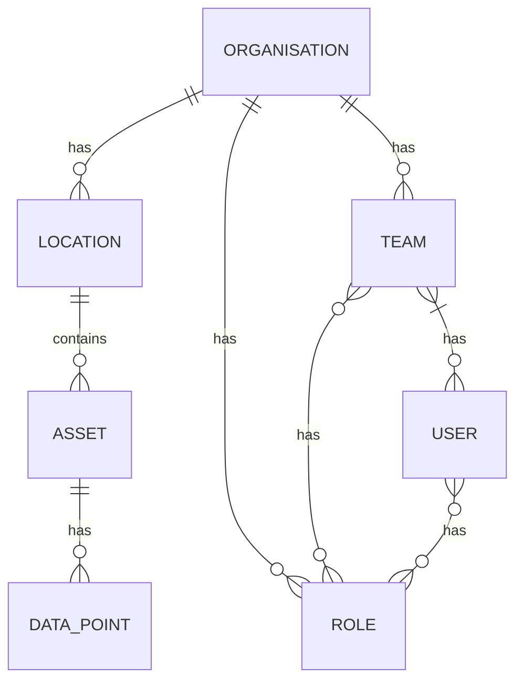

### Data Model
The data model diagram uses basic UML and are written in [Mermaid Syntax](https://mermaid.js.org/intro/n00b-syntaxReference.html), as [Entity Relationship Diagrams](https://mermaid.js.org/syntax/entityRelationshipDiagram.html#entity-relationship-diagrams).

