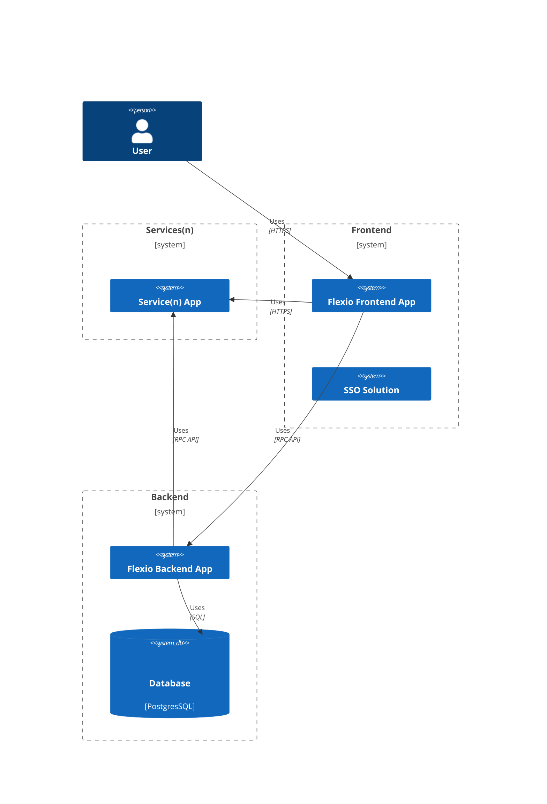

### Overview
The system overview diagram uses a [C4 Model](https://c4model.com/) written in [Mermaid Syntax](https://mermaid.js.org/intro/n00b-syntaxReference.html).
> [Mermaid C4](https://mermaid.js.org/syntax/c4.html) is currently being developed, this diagram should be reviewed after the final version is published.

